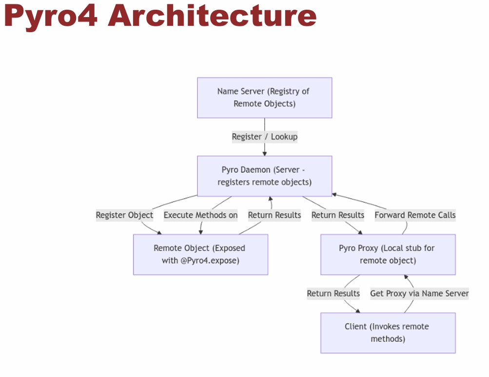
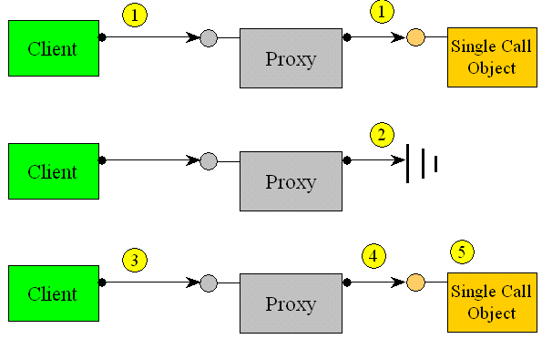
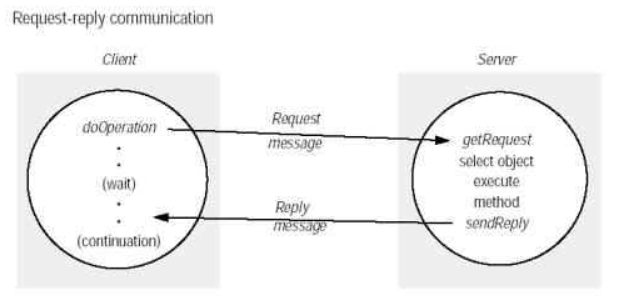

# Implementation and Evaluation of Python framework for remote object communication (PyRO)

Distributed applications are applications or software that run on multiple computers within a network at the same time Distributed software is widely used in the experiments but is often required for lab systems involving more than one boards. Writing distributed software for test purposes can be a challenge, especially for non-experts. The Python "Pyro" library provides a simple solution to address this issue.

In summary, PyRO is a remote communication framework that allows Python programs to invoke methods on remote objects as if they were local. It is used in distributed systems to facilitate communication between processes on different machines or within the same one.

Allows you to expose objects and methods across processes or machines, for simplifies the development of distributed applications.

  

## How it works?

PyRO uses direct communication, allowing clients to connect directly to remote objects through sockets. However, internally, it uses a name server to help locate these objects on the network, adding a level of indirection, but the communication between client and server remains direct.

The communication between a client and a server basically consists of two kinds of messages:
- **Method call request.**
This message consists of some identification of the target object, the method called, and the arguments for this call.
- **Return value reply.**
This message is no more than the return value of the method call.
 

**How it works?**
- Name Server Startup: Start the Name Server (typically via python -m Pyro4.naming) to register remote objects.
- Server Registration:
 The server creates a Pyro Daemon, registers its objects, and then registers them with the Name Server under a specific name.
- Client Connection:
 The client uses a Proxy (e.g., "PYRONAME:echo.server") to locate the remote 
object via the Name Server.
- Remote Invocation:
 The client calls methods on the Proxy, which are forwarded to the remote object.

 

  

 

 **Benefits **
 ► Transparent remote method invocation. 
 ► Decoupling of object location and communication. 

## Explanation of the implementation

----

 

  

### Tests cases & Validations

## How to run: