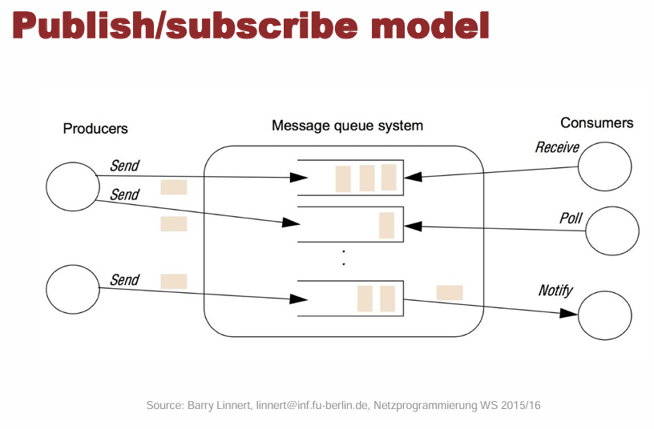
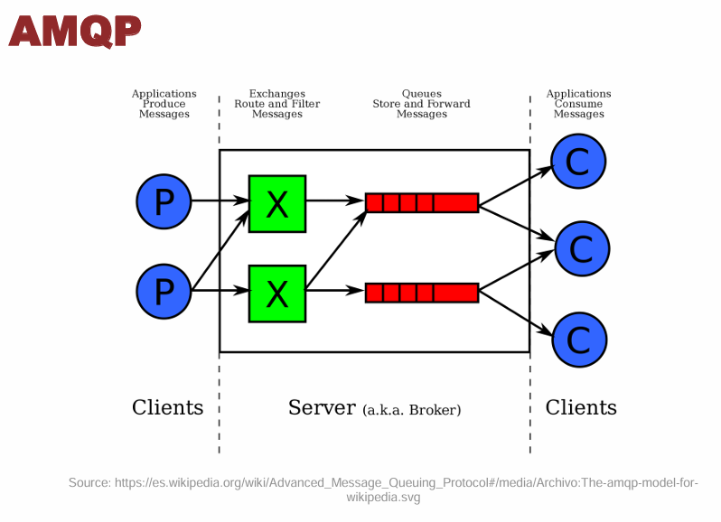

# Implementation and Evaluation of Rabbit MQ (Message Queue)

Distributed applications are those that run on multiple computers within a network at the same time. This type of software is common in laboratory systems requiring cooperation between different components. However, writing distributed applications can be complex, especially for non-experts.

RabbitMQ is an open-source message broker that enables asynchronous communication between different components of an application or system. It acts as an intermediary between producers (which send messages) and consumers (which receive and process the messages), facilitating communication and decoupling these components.

RabbitMQ is a messaging middleware that enables indirect communication between processes or machines. It allows components of an application to exchange messages without needing to know each other directly, simplifying and decoupling system design.

  

## Components

RabbitMQ comes with the next x4 basic components:

- **Producer;** Producing means nothing more than sending. A program that sends messages is a Producer.

- **Broker;** The broker has two components:
  - **Exchange;** Takes the message from the producer and route it into zero or more **queues**. The **routing algorithm** depends on the exchange type and rules called 'binding'. Here the differents types of exchange type:
    - ***Direct-exchange:*** A Direct-exchange routes the message to a queue whose binding key exactly matches the message routing key. [Image](https://lostechies.com/content/derekgreer/uploads/2012/03/DirectExchange1.png)

    - ***Fanout-exchange:*** When we want to broadcast our message, so that any queue can receive the message. [Image](https://www.pragma.com.co/hs-fs/hubfs/blog/RabbitMQ/3mensaje_exchange_tipo_fanout.-.jpg?width=1224&name=3mensaje_exchange_tipo_fanout.-.jpg)

    - ***Topic-exchange:*** Topic-exchanges route messages to one or many queues based on matching between a message routing key and the pattern on the Exchange binding key (# (Hash) → Matches zero or more words, * (Star) → Match one word). 
    ***For example;*** let's say we have messages sent to the queue for a Weather API application. The routing key takes the format of country.state.city codes (aus.nsw.syd). 
    If a consumer is interested in all messages for the NSW state in Australia, it can specify the binding with key aus.nsw.*. This sends all messages with 'aus.nsw' to that. 
    Similarly, if a consumer is interested in all messages on Australia, it can specify 'aus.#', which matches any message that starts with the aus. prefix. [Web](https://www.rahulpnath.com/blog/topic-exchange-rabbitmq-dotnet/)

    - ***Holders-exchange;*** Headers-exchange is referred to as a 'Direct-exchange on steroids'. With Headers Exchange, we are not limited to one routing key but use multiple header keys to specify the binding. When a message is sent, the Sender also populates header attributes. (x-match attribute: 'all' → matches all header values, 'any' → matches any one header value). [Image](https://www.oreilly.com/api/v2/epubs/9781787281202/files/assets/eb834f63-0248-4d2c-8c34-e22821d1e858.png)

  - **Queue;** A queue is message storage, throughput messages flow through RabbitMQ and your applications.

- **Receiver;** Consuming has a similar meaning to receiving. A consumer is a program that mostly waits to receive messages. Our consumer listens for messages from RabbitMQ. 
In order to consume messages, there has to be a queue. When a new consumer is added, assuming there are already messages ready in the queue, deliveries will start immediately.

 

## How it works?

RabbitMQ acts as a middleman between senders and receivers. Processes do not communicate directly; instead, they send and receive messages via queues managed by RabbitMQ.

- The communication process is as follows:

- A Publisher sends a message to an Exchange.

- The Exchange determines which Queue should receive the message based on routing rules.

- A Consumer retrieves the message from the queue.

This model enables asynchronous and decoupled communication, where the sender does not need to know who will receive the message.

 

**Workflow**
- RabbitMQ Server starts and manages the message broker.

- A sender publishes messages to a defined exchange.

- The receiver subscribes to a specific queue.

- RabbitMQ routes the message from the exchange to the queue, and then delivers it to the receiver.

 

  

 

 **Benefits **
 ► Asynchronous and decoupled communication. 
 ► Scalability and flexibility in distributed system design. 
 ► Supports multiple communication patterns (fanout, direct, topic). 

  

## How to run:

**1.** Dependencies, containers and frameworks installation execute `installation.sh` with sudo 
**2.** Deploy:
 `launcher.py`, using the command `python3 python3 <number_insult_services> <number_filter_services> <number_insults> <number_texts_to_filter>` for multiple-node-static, and `python3 launcher.py` for the single-node. 
 You will see all the actions in the shell.

## Services

- `InsultService`: Emits insults and handles unique insult storage.
- `InsultFilterService`: Censors insults in text data.
- `Notifier`: Manages periodic broadcast of insults to subscribers.

### References

https://www.cloudamqp.com/blog/part1-rabbitmq-for-beginners-what-is-rabbitmq.html